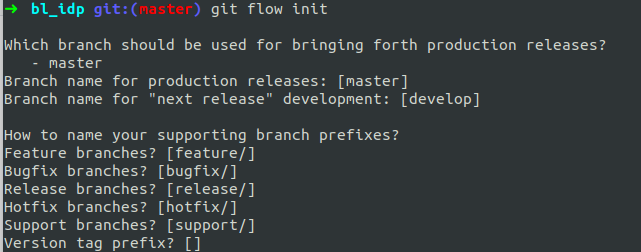

Git Flow Example:

Why should follow git flow

GitFlow is a collection of Git commands to provide many repository operations with just single command.
 It helps to keep track of features, hotfixes and releases in projects. 
 
 Advantages of Git Flow
 Gitflow was developed to manage the branching mechanism with a standardised approach when developing features, handling releases and managing hotfixes.
 Using multiple separate branches in Git will provide flexibility but gets complex. This is easy in gitflow.
 Gitflow makes developer speed up the process with familiar branch structure.
 Single command to do multiple things at a time.
 Switching branches is easy.
 Keep repository & process clean and tidy.
 
 Installation:
 
 Setup
 You need a working git installation as prerequisite.
 Git flow works on macOS, Linux and Windows
 
 macOS
 Homebrew
 $ brew install git-flow-avh
 Macports
 $ port install git-flow-avh
 
 Linux
 $ apt-get install git-flow
 Windows (Cygwin)
 $ wget -q -O - --no-check-certificate https://raw.github.com/petervanderdoes/gitflow-avh/develop/contrib/gitflow-installer.sh install stable | bash
 
 
 Getting started
 Git flow needs to be initialized in order to customize your project setup.
 
 Initialize
 Start using git-flow by initializing it inside an existing git repository:
 
 git flow init
 After installing git-flow you can use it in your project by executing git flow init. Git-flow is a wrapper around Git. 
 The git flow init command is an extension 
 of the default git init command and doesn't change anything in your repository other than creating branches for you.
 You'll have to answer a few questions regarding the naming conventions for your branches.
 It's recommended to use the default values.
 
 
 
 
 How it works
